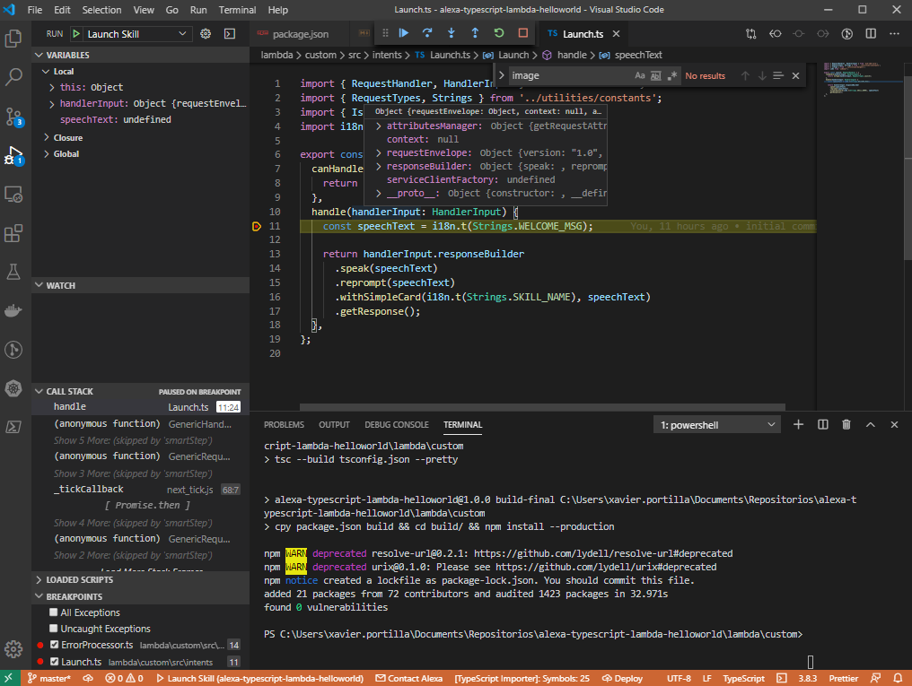

# Alexa Skill with Node.js

Alexa skills can be developed using Alexa Lambda functions or a REST API endpoint. 
Lambda function is Amazon's implementation of serverless functions available in AWS. 
Amazon recommends using Lambda functions despite they are not easy to debug. 
While you can log to a CloudWatch log, you can't hit a breakpoint and step into the code. 
 
This makes live debugging of Alexa requests a very hard task.
In this post, we will implement a custom skill for Amazon Alexa by using Node.js, npm and AWS Lambda Functions. This skill is basically a Hello World example. 
With this post you will be able to create a custom skill for Amazon Alexa, implement functionality by using Node.js and start your custom skill both from your local computer and from AWS.
This post contains materials from different resources that can be seen on Resources section.

## Prerequisites

Here you have the technologies used in this project
1. Amazon Developer Account - [How to get it](http://developer.amazon.com/)
2. AWS Account - [Sign up here for free](https://aws.amazon.com/)
3. ASK CLI - [Install and configure ASK CLI](https://developer.amazon.com/es-ES/docs/alexa/smapi/quick-start-alexa-skills-kit-command-line-interface.html)
4. Node.js v10.x
5. TypeScript
6. Visual Studio Code
7. npm Package Manager
8. Alexa ASK for Node.js (Version >2.7.0)
9. ngrok

The Alexa Skills Kit Command Line Interface (ASK CLI) is a tool for you to manage your Alexa skills and related resources, such as AWS Lambda functions.
With ASK CLI, you have access to the Skill Management API, which allows you to manage Alexa skills programmatically from the command line.
We will use this powerful tool to create, build, deploy and manage our Hello World Skill. Let's start!

## Creating the Skill with ASK CLI

For creating the Alexa Skill, we will use de ASK CLI previously configured. First of all, we have to execute this command:

```bash

    ask new

```
This command will run and interactive step-by-step creation process:

1. The first thing the ASK CLI is going to ask us is the runtime of our Skill. In our case, `Node.js v10`:


2. The second step is the template of the Skill that our Skill is going to base on. In our case, we will select `Hello World` template:


3. Finally, the ASK CLI is going to ask about the name of the Skill:


## Project Files 

These are the main files of the project:

```bash

    ├───.ask
    │       config
    │
    ├───.vscode
    │       launch.json
    ├───hooks
    ├───lambda
    │   └───custom
    │           index.js
    │           languageStrings.js
    │           local-debugger.js
    │           package.json
    │           util.js
    │
    ├───models
    │       es-ES.json
    └───skill.json

```

* .ask: folder which contains the ASK CLI's config file. This config files will remain empty until we execute the command `ask deploy`
* `.vscode/launch.json`: Launch preferences to run locally your Skill for local testing. This setting launch `lambda/custom/local-debugger.js`. This script runs a server on http://localhost:3001 for debug the Skill.
* hooks: A folder that contains the hook scripts. Amazon provides two hooks, post_new_hook and pre_deploy_hook.
  * `post_new_hook`: executed after the Skill creation. Inn Node.js runs `npm install` in each sourceDir in `skill.json`
  * `pre_deploy_hook`: executed before the Skill deployment. In Node.js runs `npm install` in each sourceDir in `skill.json` as well.
* lambda/custom: A folder that contains the source code for the skill's AWS Lambda function:
  * `index.js`: the lambda main entry point.
  * `languageStrings.js`: i18n dictionaries used by the library `i18next` which allow us to run same in Skill in different configuration languages.
  * `package.json`: this file is core to the Node.js ecosystem and is a basic part of understanding and working with Node.js, npm, and even modern JavaScript
  * `util.js`: file with helpful functions.
  * `local-debugger.js`: used for debug our skill locally.
* models – A folder that contains interaction models for the skill. Each interaction model is defined in a JSON file named according to the locale. For example, es-ES.json.
* `skill.json` – The skill manifest. One of the most important files in our project.


### Lambda function in Javascript

The ASK SDK for Node.js makes it easier for you to build highly engaging skills by allowing you to spend more time implementing features and less time writing boilerplate code.

You can find documentation, samples and helpful links in their official [GitHub repository](https://github.com/alexa/alexa-skills-kit-sdk-for-nodejs)

The main Javascript file in our lambda project is `index.js` located in `lambda/custom` folder. This file contains all handlers, interceptors and exports the Skill handler in `exports.handler`.

The `exports.handler` function is executed every time AWS Lambda is initiated for this particular function. 
In theory, an AWS Lambda function is just a single function. This means that we need to define dispatching logic so a single function request can route to appropriate code, hence the handlers.

```javascript

  /**
  * This handler acts as the entry point for your skill, routing all request and response
  * payloads to the handlers above. Make sure any new handlers or interceptors you've
  * defined are included below. The order matters - they're processed top to bottom 
  * */
  exports.handler = Alexa.SkillBuilders.custom()
      .addRequestHandlers(
          LaunchRequestHandler,
          HelloWorldIntentHandler,
          HelpIntentHandler,
          CancelAndStopIntentHandler,
          FallbackIntentHandler,
          SessionEndedRequestHandler,
          IntentReflectorHandler)
      .addErrorHandlers(
          ErrorHandler)
      .addRequestInterceptors(
          LocalisationRequestInterceptor)
      .lambda();

```
It is important to take a look into the `LaunchRequestHandler` as an example of Alexa Skill handler written in Node.js:

```javascript

  const LaunchRequestHandler = {
      //Method that returns true if this handler can execute the current request
      canHandle(handlerInput) {
          return Alexa.getRequestType(handlerInput.requestEnvelope) === 'LaunchRequest';
      },
      //Method that will process the request if the method above returns true
      handle(handlerInput) {
          const speakOutput = handlerInput.t('WELCOME_MSG');

          return handlerInput.responseBuilder
              .speak(speakOutput)
              .reprompt(speakOutput)
              .getResponse();
      }
  };

```

## Building the Skill with Visual Studio Code

Inside `package.json`, we will almost always find metadata specific to the project. 
This metadata helps identify the project and acts as a baseline for users and contributors to get information about the project.

Here is how this file looks like:

```json

  {
    "name": "alexa-nodejs-lambda-helloworld",
    "version": "1.0.0",
    "description": "Alexa HelloWorld example with NodeJS",
    "main": "index.js",
    "scripts": {
      "test": "echo \"Error: no test specified\" && exit 1"
    },
    "repository": {
      "type": "git",
      "url": "https://github.com/xavidop/alexa-nodejs-lambda-helloworld.git"
    },
    "author": "Xavier Portilla Edo",
    "license": "Apache-2.0",
    "dependencies": {
      "ask-sdk-core": "^2.7.0",
      "ask-sdk-model": "^1.19.0",
      "aws-sdk": "^2.326.0",
      "i18next": "^15.0.5"
    }
  }

```

With Javascript or Node.js the term of build is a little bit different. For build our Skill, we can run the following command:

```bash

  npm install

```

This command installs a package, and any packages that it depends on. 
If the package has a package-lock or shrink-wrap file, the installation of dependencies will be driven by that.

It could be the way to build our Alexa Skill.

## Running the Skill with Visual Studio Code

The `launch.json` file in `.vscode` folder has the configuration for Visual Studio Code which allow us to run our lambda locally:

```json

  {
    "version": "0.2.0",
    "configurations": [
        {
            "type": "node",
            "request": "launch",
            "name": "Launch Skill",
            // Specify path to the downloaded local adapter(for Node.js) file
            "program": "${workspaceRoot}/lambda/custom/local-debugger.js",
            "args": [
                // port number on your local host where the alexa requests will be routed to
                "--portNumber", "3001",
                // name of your Node.js main skill file
                "--skillEntryFile", "${workspaceRoot}/lambda/custom/index.js",
                // name of your lambda handler
                "--lambdaHandler", "handler"
            ]
        }
    ]
}

```
This configuration file will execute the following command:

```bash

  node --inspect-brk=28448 lambda\custom\local-debugger.js --portNumber 3001 --skillEntryFile lambda/custom/index.js --lambdaHandler handler

```

This configuration uses the `local-debugger.js` file which runs a [TCP server](https://nodejs.org/api/net.html) listening on http://localhost:3001

For a new incoming skill request a new socket connection is established.
From the data received on the socket the request body is extracted, parsed into JSON and passed to the skill invoker's lambda handler.
The response from the lambda handler is parsed as a HTTP 200 message format as specified [here](https://developer.amazon.com/docs/custom-skills/request-and-response-json-reference.html#http-header-1)
The response is written onto the socket connection and returned.

After configuring our launch.json file and understanding how the local debugger works, it is time to click on the play button:


After executing it, you can send Alexa POST requests to http://localhost:3001.

## Debugging the Skill with Visual Studio Code

Following the steps before, now you can set up breakpoints wherever you want inside all JS files in order to debug your skill:



## Testing requests locally

I'm sure you already know the famous tool call [Postman](https://www.postman.com/). REST APIs have become the new standard in providing a public and secure interface for your service. Though REST has become ubiquitous, it's not always easy to test. Postman, makes it easier to test and manage HTTP REST APIs. Postman gives us multiple features to import, test and share APIs, which will help you and your team be more productive in the long run.

After run your application you will have an endpoint available at http://localhost:3001. With Postman you can emulate any Alexa Request. 

For example, you can test a `LaunchRequest`:

```json

  {
    "version": "1.0",
    "session": {
      "new": true,
      "sessionId": "amzn1.echo-api.session.[unique-value-here]",
      "application": {
        "applicationId": "amzn1.ask.skill.[unique-value-here]"
      },
      "user": {
        "userId": "amzn1.ask.account.[unique-value-here]"
      },
      "attributes": {}
    },
    "context": {
      "AudioPlayer": {
        "playerActivity": "IDLE"
      },
      "System": {
        "application": {
          "applicationId": "amzn1.ask.skill.[unique-value-here]"
        },
        "user": {
          "userId": "amzn1.ask.account.[unique-value-here]"
        },
        "device": {
          "supportedInterfaces": {
            "AudioPlayer": {}
          }
        }
      }
    },
    "request": {
      "type": "LaunchRequest",
      "requestId": "amzn1.echo-api.request.[unique-value-here]",
      "timestamp": "2020-03-22T17:24:44Z",
      "locale": "en-US"
    }
  }

```

## Deploying your Alexa Skill

With the code ready to go, we need to deploy it on AWS Lambda so it can be connected to Alexa.

Before deploy the Alexa Skill, we can show the `config` file in `.ask` folder it is empty:

```json
    {
      "deploy_settings": {
        "default": {
          "skill_id": "",
          "was_cloned": false,
          "merge": {}
        }
      }
    }

```

Deploy Alexa Skill with ASK CLI:

```bash
    ask deploy
```

As the official documentation says:

When the local skill project has never been deployed, ASK CLI creates a new skill in the development stage for your account, then deploys the skill project. If applicable, ASK CLI creates one or more new AWS Lambda functions in your AWS account and uploads the Lambda function code. Specifically, ASK CLI does the following:

1. Looks in your skill project's config file (in the .ask folder, which is in the skill project folder) for an existing skill ID. If the config file does not contain a skill ID, ASK CLI creates a new skill using the skill manifest in the skill project's skill.json file, then adds the skill ID to the skill project's config file.
2. Looks in your skill project's manifest (skill.json file) for the skill's published locales. These are listed in the manifest.publishingInformation.locales object. For each locale, ASK CLI looks in the skill project's models folder for a corresponding model file (for example, es-ES.json), then uploads the model to your skill. ASK CLI waits for the uploaded models to build, then adds each model's eTag to the skill project's config file.
3. Looks in your skill project's manifest (skill.json file) for AWS Lambda endpoints. These are listed in the manifest.apis.<skill type>.endpoint or manifest.apis.<skill type>.regions.<region code>.endpoint objects (for example, manifest.apis.custom.endpoint or manifest.apis.smartHome.regions.NA.endpoint). Each endpoint object contains a sourceDir value, and optionally a uri value. ASK CLI upload the contents of the sourceDir folder to the corresponding AWS Lambda function and names the Lambda function the same as the uri value. For more details about how ASK CLI performs uploads to Lambda, see AWS Lambda deployment details.
4. Looks in your skill project folder for in-skill products, and if it finds any, uploads them to your skill. For more information about in-skill products, see the In-Skill Purchasing Overview.


After the execution of the above command, we will have the `config` file properly filled:

```json

  {
    "deploy_settings": {
      "default": {
        "skill_id": "amzn1.ask.skill.ed038d5e-61eb-4383-a480-04e3398b398d",
        "was_cloned": false,
        "merge": {},
        "resources": {
          "manifest": {
            "eTag": "faa883c92faf9a495407f0d03d5e3790"
          },
          "interactionModel": {
            "es-ES": {
              "eTag": "c9e7fd862be0dd3b21252b8bca53c7f7"
            }
          },
          "lambda": [
            {
              "alexaUsage": [
                "custom/default"
              ],
              "arn": "arn:aws:lambda:us-east-1:141568529918:function:ask-custom-alexa-nodejs-lambda-helloworld-default",
              "awsRegion": "us-east-1",
              "codeUri": "lambda/custom",
              "functionName": "ask-custom-alexa-nodejs-lambda-helloworld-default",
              "handler": "index.handler",
              "revisionId": "ef2707ee-a366-484d-a4b7-3826a44692dd",
              "runtime": "nodejs10.x"
            }
          ]
        }
      }
    }
  }

```

## Test requests directly from Alexa

ngrok is a very cool, lightweight tool that creates a secure tunnel on your local machine along with a public URL you can use for browsing your local site or APIs.

When ngrok is running, it listens on the same port that you’re local web server is running on and proxies external requests to your local machine

From there, it’s a simple step to get it to listen to your web server. Say you’re running your local web server on port 3001. In terminal, you’d type in: `ngrok http 3001`. This starts ngrok listening on port 3001 and creates the secure tunnel:


So now you have to go to [Alexa Developer console](https://developer.amazon.com/alexa/console/ask), go to your skill > endpoints > https, add the https url generated above . Eg: https://20dac120.ngrok.io.

Select the My development endpoint is a sub-domain.... option from the dropdown and click save endpoint at the top of the page.

Go to Test tab in the Alexa Developer Console and launch your skill.

The Alexa Developer Console will send a HTTPS request to the ngrok endpoint (https://20dac120.ngrok.io) which will route it to your skill running on Web API server at http://localhost:3001.


## Resources
* [Official Alexa Skills Kit Node.js SDK](https://www.npmjs.com/package/ask-sdk) - The Official Node.js SDK Documentation
* [Official Alexa Skills Kit Documentation](https://developer.amazon.com/docs/ask-overviews/build-skills-with-the-alexa-skills-kit.html) - Official Alexa Skills Kit Documentation


## Conclusion 

This was a basic tutorial to learn Alexa Skills using Node.js.
As you have seen in this example, the Alexa Skill Kit for Node.js and the Alexa Tools like ASK CLI can help us a lot and also they give us the possibility to create skills in an easy way. 
I hope this example project is useful to you.

That's all folks!

Happy coding!
